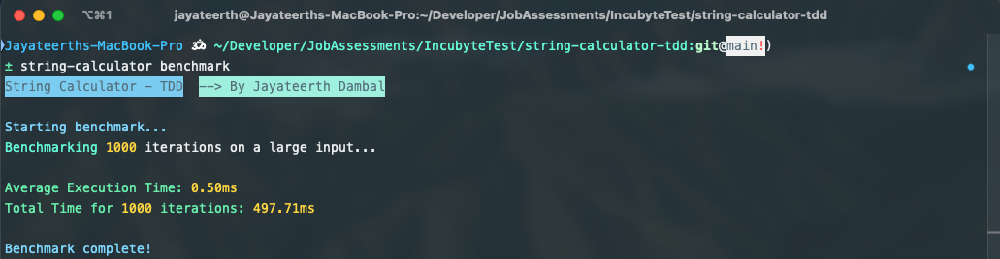
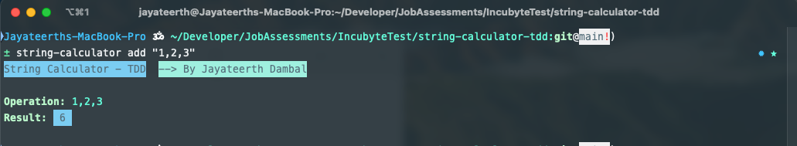

# String Calculator (TDD Kata)

[](https://www.typescriptlang.org/)
[](https://jestjs.io)
[](https://nodejs.org)
[](https://github.com/features/actions)

An implementation of the [Incubyte's String Calculator Kata](https://blog.incubyte.co/blog/tdd-assessment/) following Test-Driven Development (TDD) principles, built with TypeScript and Jest. In this project I demonstrated clean code practices, comprehensive test coverage, and professional development workflows.

---
## Screenshots

### 1. CLI Benchmark Command


### 2. CLI Add Command


## Loom Video
[Click Here for the Loom Video Demonstration](https://www.loom.com/share/433bc90a77504541940d1fe9b076b145?sid=8ba79cf7-f66f-4a6b-8800-45bf5ddd1564)

<p align="center">
  <a href="#key-features">Key Features</a> •
  <a href="#tech-stack">Tech Stack</a> •
  <a href="#installation">Installation</a> •
  <a href="#tdd-approach">TDD Approach</a>
</p>

## Key Features

- **TDD Implementation**: Strict red-green-refactor cycle with atomic commits
- **Robust Validation**:
  - Empty string handling → `0`
  - Negative number detection with descriptive errors
  - Custom delimiter support (`//[delimiter]\n...`)
- **100% Test Coverage**: Comprehensive test suite with edge cases
- **CI/CD Pipeline**: Automated testing via GitHub Actions
- **Type Safety**: Full TypeScript implementation with strict checks

## Bonus Point Features

- **Multi-Character Delimiters**: Supports delimiters like `***` or `!!`
- **Multiple Delimiters**: Handles formats like `//[*][%]\n1*2%3`
- **Regex Safety**: Properly escapes special characters in delimiters
- **Benchmarking**: Measure the performance of the string calculator with large inputs.

## Tech Stack

- **Language**: TypeScript
- **Testing**: Jest + ts-jest
- **Package Manager**: npm
- **Linting**: ESLint + Prettier
- **CI/CD**: GitHub Actions
- **Code Quality**: 100% test coverage enforced

## Installation

### Prerequisites

- Node.js v18+
- npm v9+

```bash
# Clone repository
git clone https://github.com/jayateerthdambal/string-calculator-tdd.git
cd string-calculator-tdd

# Install dependencies
npm ci  # Uses exact versions from package-lock.json
```

### CLI Tool

The String Calculator CLI Tool lets you interactively test the functionality of the calculator directly from your terminal. It includes commands for operations, testing, and benchmarking.

### Created Commands

  1. Add Numbers

  ```bash
  npm run build
  npm link
  string-calculator add "<input>"
  ```

  2. Run Predefined Tests

  ```bash
  string-calculator test
  ```

  3. Run Benchmark on Large Inputs

  ```bash
  string-calculator benchmark
  ```

## TDD Approach

- Red Phase: Wrote failing test for feature
- Green Phase: Minimal implementation to pass test
- Refactor Phase: Improved code quality without changing behavior
- Repeat: Atomic commits for each TDD cycle

## CI/CD

- GitHub Actions workflow ensures:
- Automated testing on all pushes and PRs
- Node.js version matrix testing (16.x, 18.x)
- Strict type checking
- Linting enforcement

### Commit Message Guidelines

- `FEAT`: New functionality
- `fix`: Bug resolution
- `refactor`: Code improvement without behavior change
- `docs`: Documentation updates

### Feel Free to Add Changes

Fork the repository.
Create a feature branch: git checkout -b feature/<feature-name>.
Commit changes: git commit -m "Add: <feature-description>".
Push to the branch: git push origin feature/<feature-name>.
Open a pull request on the repo.

### Summary of Updates

- Added CLI Tool with commands for add, test, and benchmark.
- Enhanced README to reflect CLI instructions, examples, and features.
- Ensured strict practice to TDD and clean coding practices.

<div align="center"> <sub>Developed with ❤︎ by Jayateerth Dambal | Incubyte TDD Assessment</sub> </div> ```
